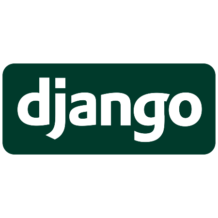

# Django ToDo App

### A ToDo List App Based on Python's Django Framework
## Technologies Used




## Build Guide

1. Clone the repository.
```bash
$ git clone https://github.com/kaziiriad/django_todo_app.git
$ cd django_todo_app
```

2. Build and run with Docker.

```bash
$ docker build -t <container_name> .
$ docker run -d -p 8000:8000 <container_name>
```

3. Visit https://localhost:8000 to open the app.